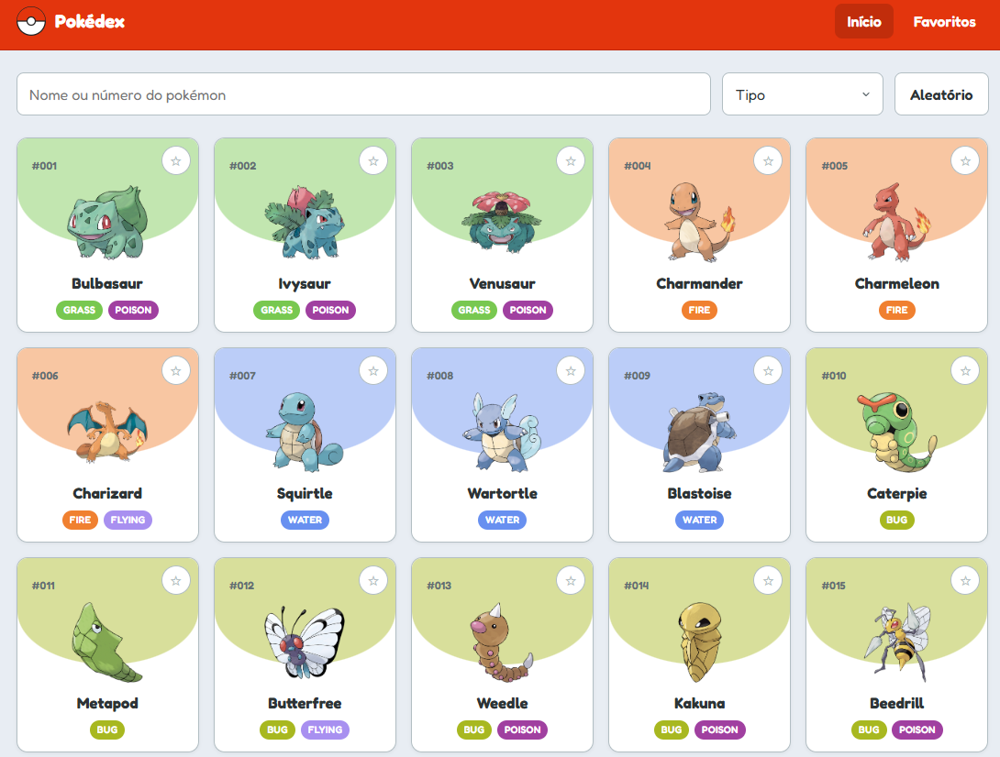
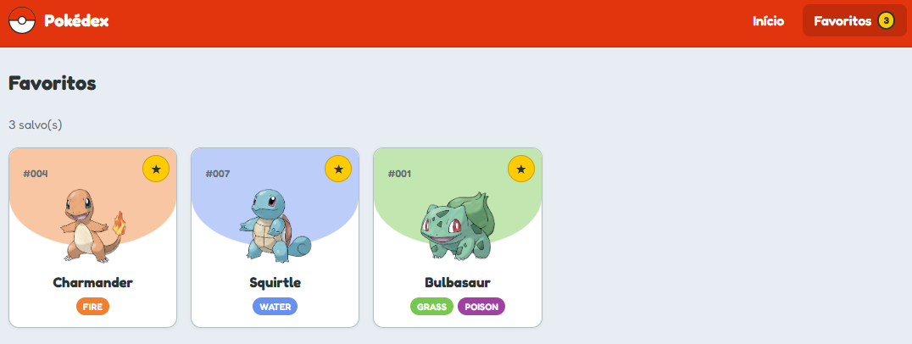
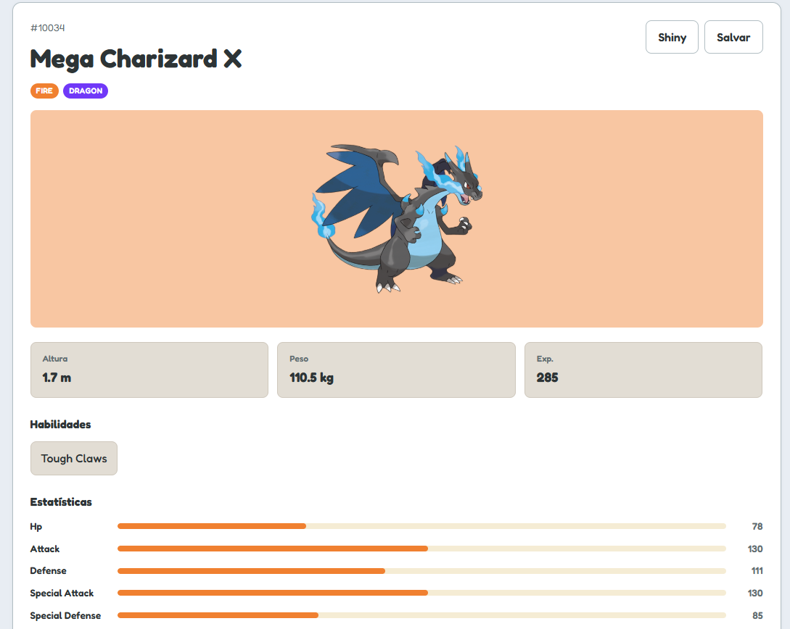

# Pokédex React

Pokédex interativa desenvolvida com React, consumindo dados da [PokeAPI](https://pokeapi.co/).

**Demo:** [arthurcruzz17.github.io/pokedex-react](https://arthurcruzz17.github.io/pokedex-react/)

---

## Screenshots

### Página inicial


### Favoritos 


### Detalhes 


---

## Funcionalidades

- Listagem paginada com botão **Carregar mais**
- Busca por nome ou número (com debounce)
- Filtro por tipo elementar
- Botão **Aleatório** para descobrir um Pokémon
- Página de **detalhes** com altura, peso, experiência, habilidades e estatísticas
- Visualização **Shiny**
- **Cadeia evolutiva** e formas **Mega**
- **Favoritos** salvos no `localStorage`
- Navegação entre Pokémon (anterior / próximo)

---

## Tecnologias

React · Vite · React Router · JavaScript · CSS · PokeAPI

---

## Como rodar localmente

```bash
npm install
npm run dev
```

Abre em `http://localhost:5173`.

---

## Estrutura do projeto

`src/components` · `pages` · `hooks` · `services` · `constants`

---

## Autor

**Arthur de Paula Cruz**

- GitHub: [@ArthurCruzz17](https://github.com/ArthurCruzz17)

---

## Créditos

Dados e imagens dos Pokémon via [PokeAPI](https://pokeapi.co/).
